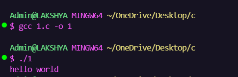
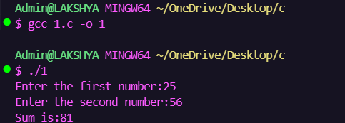
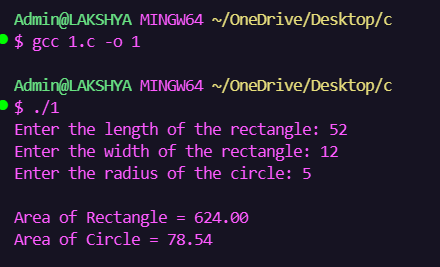
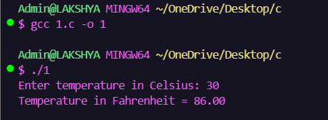
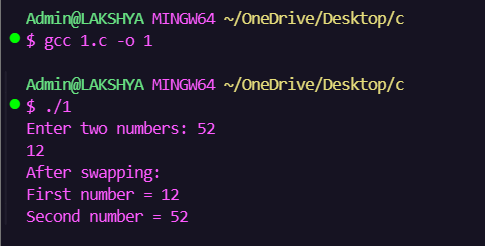

🚀 Assignment 1
Introduction to Programming

──────────────────────────────

✨ Overview

📚 Programs Included

✅ Hello World

✅ Sum of Two Numbers

✅ Area Calculator

✅ Temperature Converter

✅ Swap Numbers

──────────────────────────────

🎯 Objectives

• Learn C Syntax
• Understand Variables
• Input & Output
• Mathematical Operations
• Console Programming

──────────────────────────────

📂 Folder Structure

📁 Assignment-1
 ├── Q1_HelloWorld.c
 ├── Q2_Sum.c
 ├── Q3_Area.c
 ├── Q4_Temperature.c
 ├── Q5_Swap.c
 └── Screenshots

──────────────────────────────

📊 Progress

Coding           ██████████ 100%

Testing          ██████████ 100%

Documentation    ██████████ 100%

Screenshots      ██████████ 100%

──────────────────────────────

💻 Tech Stack

C
Git
GitHub
VS Code

──────────────────────────────

📸 Output Gallery

    
──────────────────────────────

🎓 Learning Outcomes

✔ Variables

✔ Data Types

✔ scanf()

✔ printf()

✔ Operators

✔ Logic Building

──────────────────────────────

⭐ Status

Assignment Completed Successfully ✅