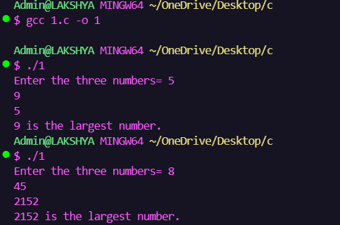
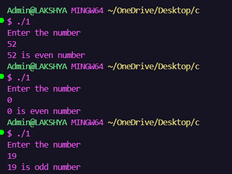
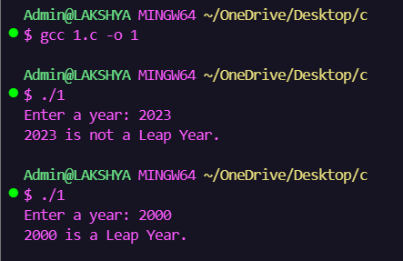
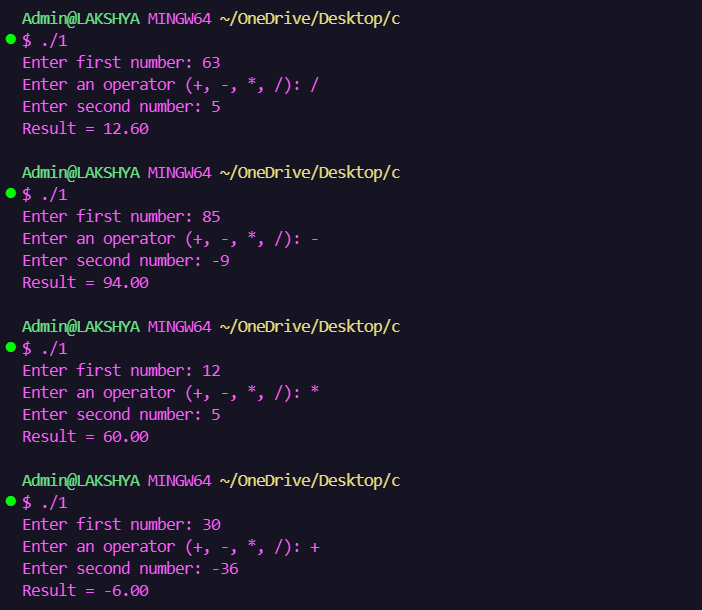
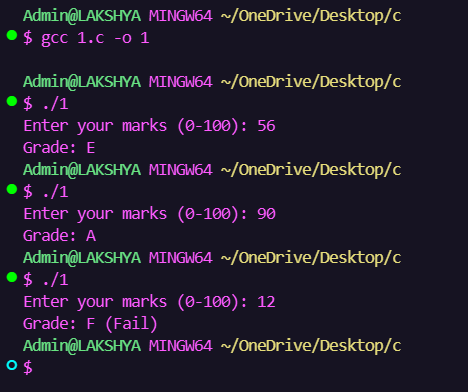

🧠 Assignment 2

Conditional Statements

══════════════════════════════

🔥 Overview

This assignment focuses on decision-making in C programming using

✔ if

✔ if-else

✔ else-if

✔ switch-case

══════════════════════════════

📚 Programs

✅ Largest of Three Numbers

✅ Even/Odd

✅ Leap Year

✅ Calculator

✅ Grade System

══════════════════════════════

🛠 Concepts Covered

Decision Making

Nested if

Logical Operators

Comparison Operators

Switch Case

Flowcharts

══════════════════════════════

🧩 Program Flow

Input

↓

Condition Check

↓

Execution

↓

Output

══════════════════════════════

📊 Completion

Source Code      ██████████

Flowcharts       ██████████

Output           ██████████

Documentation    ██████████

══════════════════════════════

📂 Folder Structure

Assignment-2
├── Q1.c

├── Q2.c

├── Q3.c

├── Q4.c

├── Q5.c

└── Screenshots

══════════════════════════════

📸 Output Gallery

    

══════════════════════════════

🎯 Skills Gained

Problem Solving

Decision Making

Algorithm Design

Logical Thinking

Debugging

══════════════════════════════

🏁 Final Status

Successfully Completed 🎉
