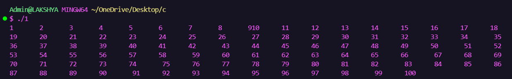
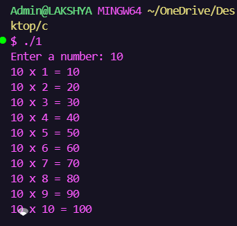
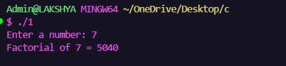
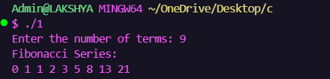
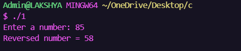
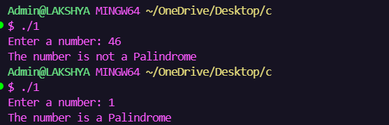
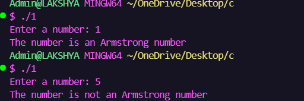
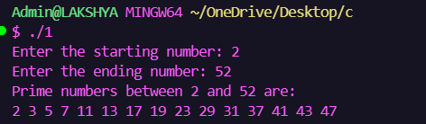
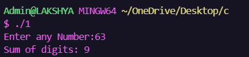
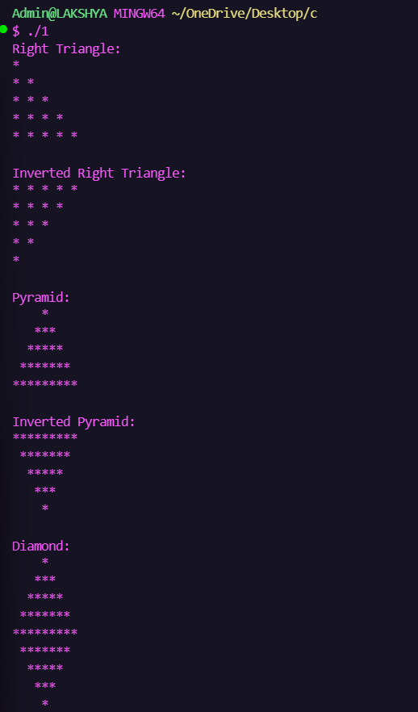

<div align="center">

# 🚀 Assignment 3 - Loop Based Programming


</div>

---

## 📖 Overview

This repository contains **10 loop-based programming problems** implemented in **C Programming** as part of **Week 2** of the Summer Internship Program.

---

## 🎯 Programs

| No. | Program | Status |
|:--:|-------------------------------|:--:|
| 1 | Print Numbers (1–100) | ✅ |
| 2 | Multiplication Table | ✅ |
| 3 | Factorial | ✅ |
| 4 | Fibonacci Series | ✅ |
| 5 | Reverse Number | ✅ |
| 6 | Palindrome Number | ✅ |
| 7 | Armstrong Number | ✅ |
| 8 | Prime Numbers in Range | ✅ |
| 9 | Sum of Digits | ✅ |
| 10 | Star Patterns | ✅ |

---

## 📂 Folder Structure

```text
Assignment-3
│
├── README.md
├── Q1_Print_1_to_100.c
├── Q2_Multiplication_Table.c
├── Q3_Factorial.c
├── Q4_Fibonacci.c
├── Q5_Reverse_Number.c
├── Q6_Palindrome.c
├── Q7_Armstrong.c
├── Q8_Prime_Range.c
├── Q9_Sum_of_Digits.c
└── Q10_Star_Patterns.c
```

---

📸 Output Gallery

    

---

## 🛠️ Tech Stack

<p align="center">

</p>

---

## 📚 Concepts Covered

- 🔁 For Loop
- 🔄 While Loop
- 🔂 Do-While Loop
- ⭐ Nested Loops
- 🧠 Number-Based Logic
- 📐 Pattern Printing

---

## 📊 Progress

```text
Programs Completed    ████████████████████ 100%
Algorithms            ████████████████████ 100%
Outputs               ████████████████████ 100%
```

---

## 🌟 Learning Outcomes

- Improved logical thinking
- Better understanding of loops
- Pattern generation
- Mathematical programming
- Problem-solving using C

---

<div align="center">

### ⭐ Thank You!


</div>
