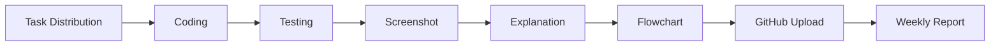
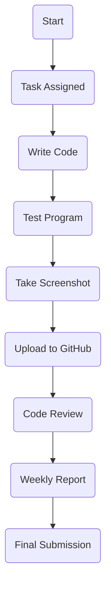

<div align="center">

# 🚀 Week 1 – Introduction to Programming
### Summer Internship Program (SIP) 2026


<p>


</p>

---

### ✨ Team Absolute

> **"Great software is built through teamwork, collaboration, and continuous learning."**

</div>

---

# 📖 About

This repository contains the **Week 1 assignments** of the **Summer Internship Program (SIP)** based on **Introduction to Programming using C**.

The objective of this week was to strengthen the fundamentals of programming by implementing basic C programs, understanding conditional statements, preparing explanations, creating flowcharts, maintaining documentation, and collaborating using GitHub.

---

# 📂 Repository Structure

```
Week-1/
│
├── Assignment-1/
│   ├── Q1_HelloWorld.c
│   ├── Q2_SumOfNumbers.c
│   ├── Q3_AreaCalculation.c
│   ├── Q4_TemperatureConversion.c
│   ├── Q5_SwapNumbers.c
│   ├── Screenshots/
│   └── README.md
│
├── Assignment-2/
│   ├── Q1_LargestNumber.c
│   ├── Q2_EvenOdd.c
│   ├── Q3_LeapYear.c
│   ├── Q4_Calculator.c
│   ├── Q5_GradeSystem.c
│   ├── Flowcharts/
│   ├── Screenshots/
│   └── README.md
│
└── Weekly_Report/
```

---

# 📚 Assignment Overview

## 📌 Assignment 1 – Basic Input & Output

| Question | Topic | Status |
|----------|-------|--------|
| Q1 | Hello World | ✅ |
| Q2 | Sum of Two Numbers | ✅ |
| Q3 | Area of Rectangle & Circle | ✅ |
| Q4 | Celsius to Fahrenheit | ✅ |
| Q5 | Swap Numbers | ✅ |

---

## 📌 Assignment 2 – Conditional Statements

| Question | Topic | Status |
|----------|-------|--------|
| Q1 | Largest of Three Numbers | ✅ |
| Q2 | Even or Odd | ✅ |
| Q3 | Leap Year | ✅ |
| Q4 | Calculator using Switch Case | ✅ |
| Q5 | Grade Assignment | ✅ |

---

# 👨‍💻 Team Members & Responsibilities

| Team Member | Responsibility |
|-------------|---------------|
| 👩 **Supriya** | Assignment 1 (Q1, Q2), Assignment 2 (Q1, Q2) |
| 👨 **Chunar** | Assignment 1 (Q3, Q4), Assignment 2 (Q3) |
| 👨 **Abhishek** | Assignment 1 (Q5), Assignment 2 (Q4, Q5) |
| 👨 **Lakshya (Group Leader)** | Code Explanations, Flowcharts, Team Supervision, GitHub Management, Guidance & Quality Review |
| 👩 **Roshni** | Weekly Report, Documentation, Final PPT Support |

---

# 👑 Leadership Role

## Lakshya – Group Leader

Responsibilities included:

- ✅ Task distribution
- ✅ Team coordination
- ✅ Code review
- ✅ Debugging support
- ✅ Explanation writing
- ✅ Flowchart preparation
- ✅ GitHub repository management
- ✅ Ensuring timely completion
- ✅ Helping every team member whenever required

---

# 🛠 Skills Practiced

- C Programming
- Input & Output
- Variables
- Operators
- Conditional Statements
- Switch Case
- Flowcharts
- Documentation
- GitHub Collaboration
- Team Management

---

# 📸 Deliverables

### Assignment 1

- ✅ Source Code
- ✅ Output Screenshots
- ✅ 100-word Explanations

### Assignment 2

- ✅ Source Code
- ✅ Output Screenshots
- ✅ Flowcharts
- ✅ Explanations

---

# 🔄 Workflow Followed



---

# 🌟 Project Workflow



---

# 📊 Progress

| Task | Progress |
|------|----------|
| Assignment 1 | ██████████ 100% |
| Assignment 2 | ██████████ 100% |
| Screenshots | ██████████ 100% |
| Explanations | ██████████ 100% |
| Flowcharts | ██████████ 100% |
| Documentation | ██████████ 100% |
| Weekly Report | ██████████ 100% |

---

# 💻 Technologies Used

<p align="center">


</p>

---

# 📈 Learning Outcomes

✔ Fundamentals of C Programming

✔ Console Input & Output

✔ Variables & Data Types

✔ Arithmetic Operations

✔ Conditional Statements

✔ Switch Case

✔ Team Collaboration

✔ GitHub Workflow

✔ Documentation Practices

✔ Leadership & Project Coordination

---

# 🤝 Collaboration

Every member completed their assigned work independently while collaborating through GitHub.

The repository was maintained using version control, ensuring proper contribution tracking and organized submission.

---

# 🎯 Week 1 Status

<div align="center">

## ✅ Successfully Completed


</div>

---

<div align="center">

### ⭐ If you found this repository helpful, don't forget to Star it!

**Made with ❤️ by Team SIP 2026**

</div>
